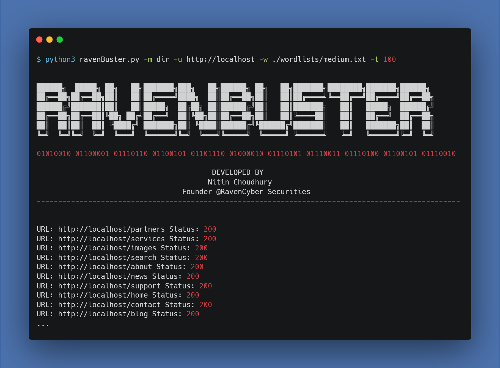
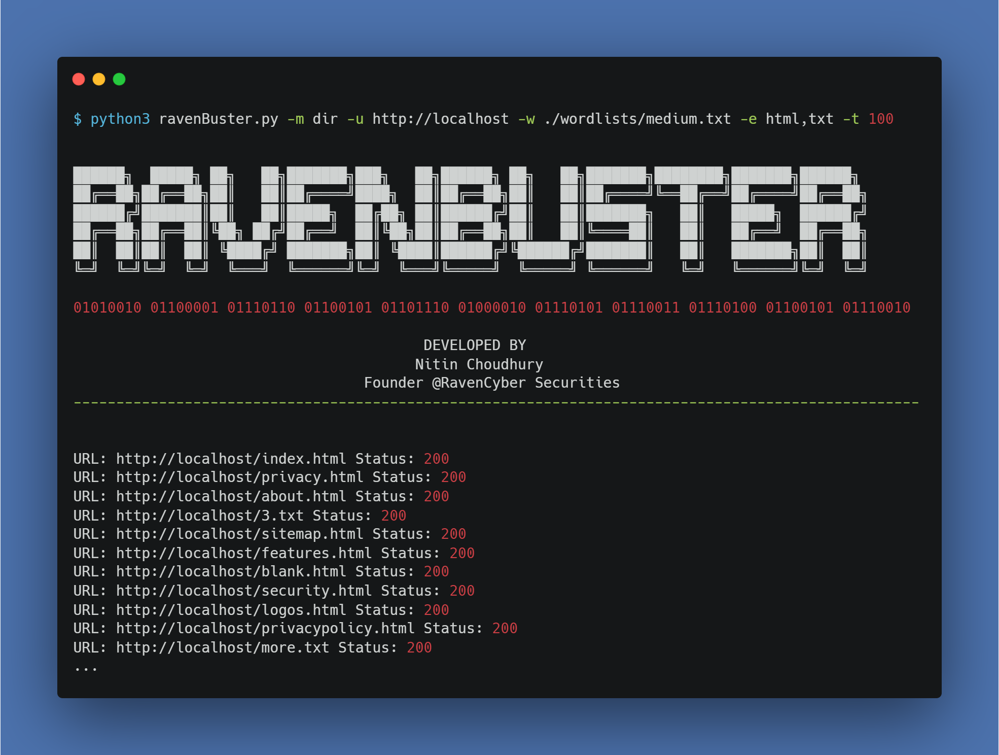
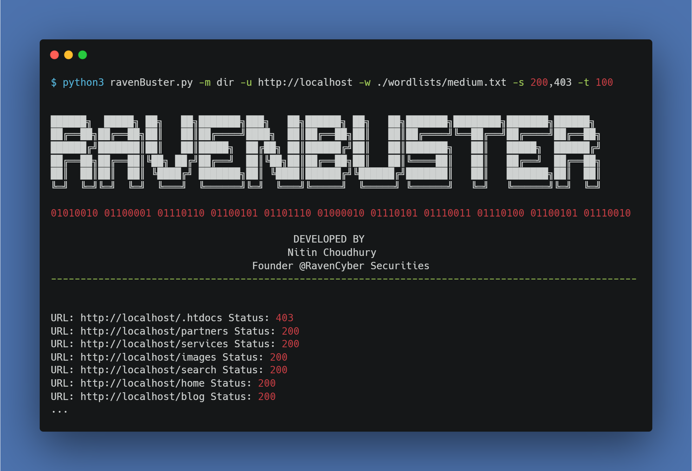

# ravenBuster
RavenBuster is a directory, file and subdomain busting tool that has functionality to find directories and files using dictionary attack technique. In order to use this tool, you will be needed a dictionary or a wordlist file. 


Be careful using the tool in multi-threaded mode since it can be treated as DoS attack and your IP can be blocked by the cloud host. 


## Requirements
This is a python based file. So, to run this file you will require a python environment.

## Set-Up
Step-1: Download the zip file or clone

`git clone https://github.com/nitin293/RavenBuster/`

Step-2: Run the file

```
cd ravenBuster/
python3 ravenBuster.py --help
```


## Uses

> DIRECTORY BUSTING
* Run using multi-threading

`python3 ravenBuster.py -m dir -u http://localhost -w ./wordlists/medium.txt -t 100`




* Run in recursive mode to find nested directories

>> Can't be run in multi-threaded mode

`python3 ravenBuster.py -m dir -u http://localhost -w ./wordlists/medium.txt --recursion True`


* Search for files with specific extension

>> Can be run with multi-threading

`python3 ravenBuster.py -m dir -u http://localhost -w ./wordlists/medium.txt -e html,txt -t 100`




* Run by filtering response code

>> can be run in multi-threaded mode

`python3 ravenBuster.py -m dir -u http://localhost -w ./wordlists/medium.txt -t 100`




> SUBDOMAIN BUSTING
* Run using multi-threading

`python3 ravenBuster.py -m sub -u http://localhost -w ./wordlists/medium.txt -t 100`


